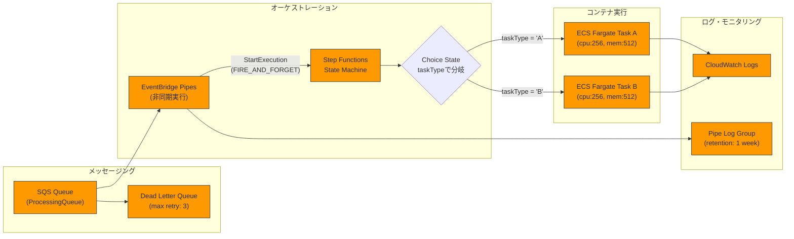

# Welcome to your CDK TypeScript project

This is a blank project for CDK development with TypeScript.

The `cdk.json` file tells the CDK Toolkit how to execute your app.

## Useful commands

* `npm run build`   compile typescript to js
* `npm run watch`   watch for changes and compile
* `npm run test`    perform the jest unit tests
* `npx cdk deploy`  deploy this stack to your default AWS account/region
* `npx cdk diff`    compare deployed stack with current state
* `npx cdk synth`   emits the synthesized CloudFormation template

## PoC

```
aws sqs send-message \
  --queue-url "<YOUR_SQS_QUEUE_URL>" \
  --message-body '{"s3FilePath": "s3://my-bucket/path/to/file.txt"}' \
  --message-attributes '{"taskType": {"DataType": "String", "StringValue": "A"}}'
```

以下のMermaid図で、実装されたアーキテクチャを表現します：



このアーキテクチャの主な特徴は以下の通りです：

1. **メッセージング層**
   - SQSキューがメッセージを受信
   - 3回の再試行後、失敗したメッセージはDLQへ移動

2. **オーケストレーション層**
   - EventBridge PipesがSQSからメッセージを取得し、非同期でStep Functionsを起動
   - Step FunctionsのChoice状態で、taskTypeに応じて実行するタスクを分岐

3. **実行層**
   - 2種類のECS Fargateタスク（A/B）を最小リソースで実行
   - 各タスクは同一のDockerイメージを使用し、環境変数で動作を制御

4. **監視層**
   - ECSタスクのログはCLOUDWATCH LOGSに出力
   - EVENTBRIDGE PIPESのエラーログは専用のLOG GROUPに保存（1週間保持）

このアーキテクチャにより、メッセージキューイング、非同期実行、エラーハンドリング、ログ管理を備えたスケーラブルな処理基盤が実現されています。
